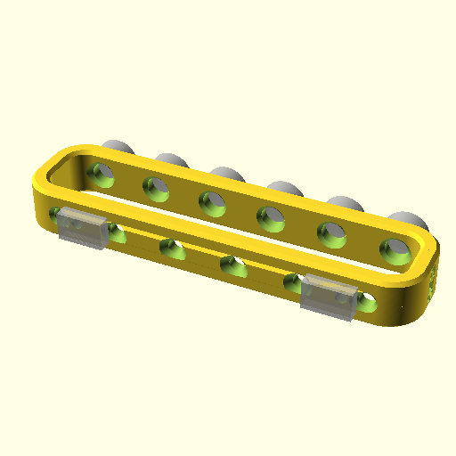
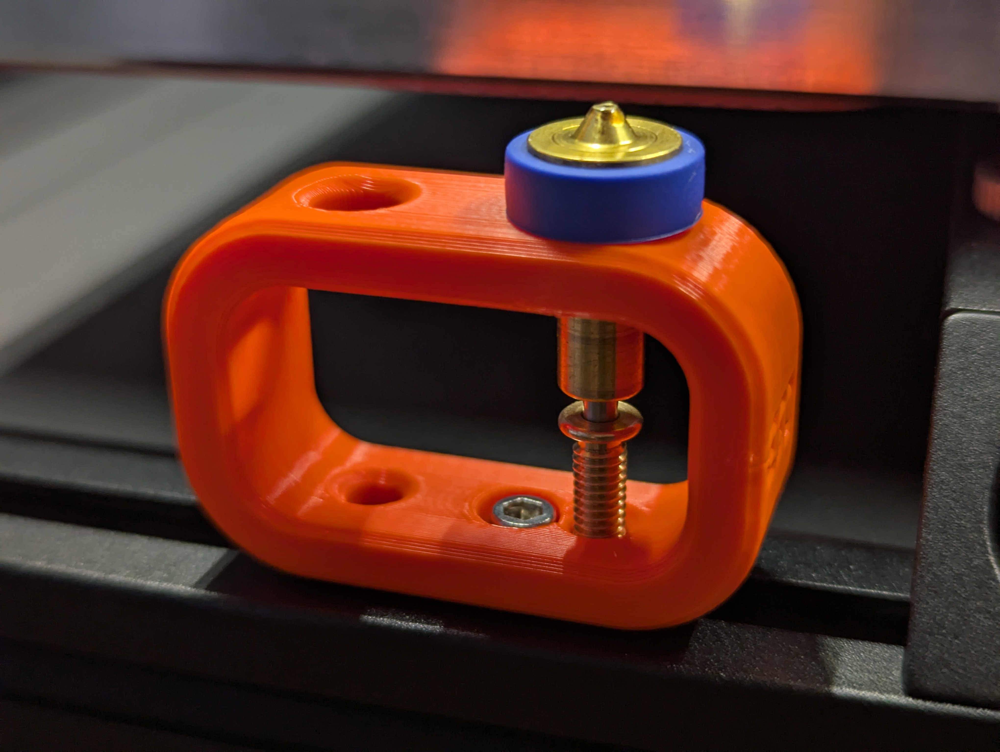

# E3D Revo Nozzle Holder for Voron Printers

Store your nozzles inside the Voron printer on a holder mounted to the frame
extrusion.

You may screw this nozzle holder onto the frame extrusion of your Voron
printer.  To do so, you need M3 roll-in nuts and M3x8 screws that you are
familiar with from your Voron build.  The holder comes in variants from 2 to 6
nozzles capacity.  For the variant with 2 nozzles, you need 1 screw and 1 nut;
for the larger models, you need 2 screws and 2 nuts. Make sure that you align
the roll-in nuts in a way that they do not block the holes to store the nozzle
in!

There are other similar holders available, but this one is more minimalistic
than the others I found and requires less space since they are designed in a
way that part of your nozzle sinks into the free space of the extrusion.
Additionally, in my opinion, this model is more aesthetic, but for sure I am
biased here.

The models feature small E3D logos on the sides. For those who do not like
this and want an even more minimalistic-looking version, I added versions
without the logo as well.

I tested this on my V2.4r2 but given it needs only a little space and an 2020
extrusion it should work at least on any V2 and Trident printers.  If you
tested this on any other printer than the V2.4r2, please let me know!

## Printing

Use standard voron print settings. 4 walls, 5 top & bottom laters, 40% infill.

